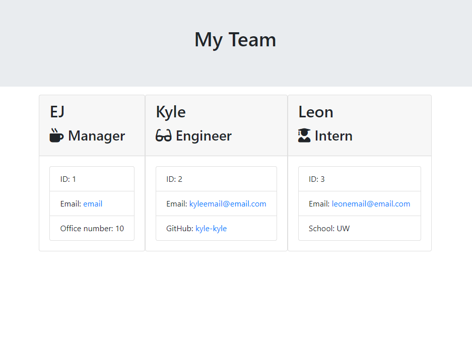

# Team Profile Generator

## Description
Welcome to the 'Team Profile Generator'! Here you will be able to generate your team's profile by answering a series of questions within your terminal. This application consisted of HTML, JavaScript, and node.js. Node.js provided the primary functionality for this application. To generate your team, you had to answer questions that pertained to each member's title. Each title, for example Manager, Engineer, and Intern, were created within the JavaScript as classes. The title's previously mentioned all inherited an Employee class. The purpose of this was to encapsulate code. This was beneficially to the application as the code had high reusibility and that code did not have to be rewritten multiple times. 
Some challenges that I faced with this project was figuring out how to create HTML files from the JavaScript. However, with the node package manager (npm), I was able to to import several methods that can create the necessary files. 
After completing this application, I have recognized the importance and benefits of Object Oriented Programming (OOP).

## Installation
You will need to install the necessary Node.js packages within the integrated terminal. Execute 'npm install' to download the packages. 

## Usage
Open the integrated terminal within the application. After installing the necessary packages, execute 'node index.js'. You will then be given the options to 'Create Your Team' or 'Quit'. A series of questions will then appear. After creating your team you can exit the application by selecting 'Quit'. An HTML file will then be created within the '/dist' folder. 

## Screenshots of Example

## Video of Example

## Links
Github Repository: https://github.com/bear-muna/team-profile-generator